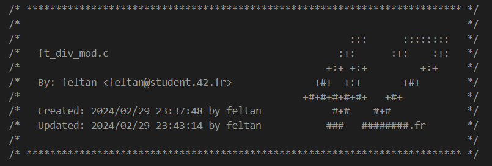
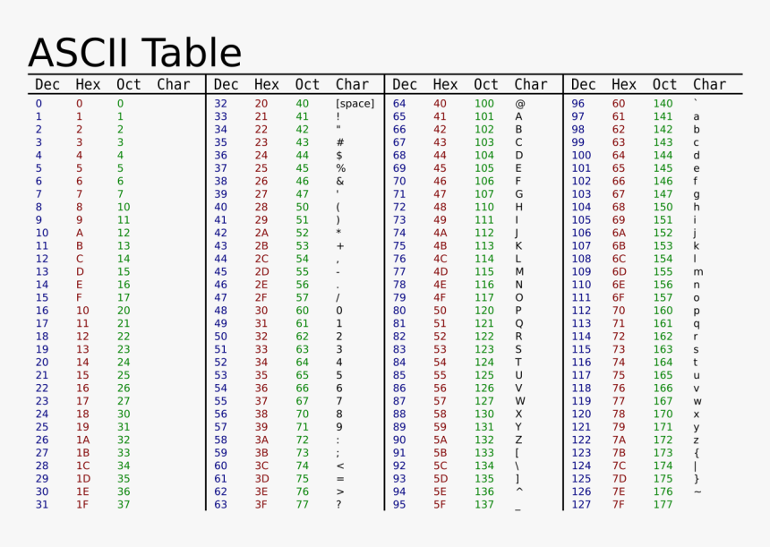

# C Information 🔽

## Submission 📟

### **Header**

All C projects at 42 require you to have a header on-top of your .c file that looks something like this:

To create this header, you can follow the below instructions:

- **VSCode**: Search for 42 Header and download the extension.
- [Vim](https://42.nauman.cc/2023/06/01/getting-started-42-header/)

### **Compilation**

Ensure that your program / function compiles. Moulinette compiles with the following command:

- `cc -Wall -Wextra -Werror filename.c`

then type the following if its a function (e.g. ft_putchar.c):

- `./a.out`

or type the following if its a program (e.g. int main(int argc, char \*\*argv)):

- `./a.out 'str1' 'str2'`

### **Norminette**

Ensure that you're submitting only the program / function requested. This means:

- Delete the `./a.out` file
- Delete the main function and submit only your solution function (eg. `ft_putchar`) if the exercise is asking for a function
- Delete any unused libraries
- Run `norminette -R CheckForbiddenSourceHeader`. The flag is important as Moulinette would be using it as well

## C Libraries 📚

This Github Repo uses only 3 C System Standard Libraries:

- `#include <unistd.h>` - for the `write` function.
- `#include <stdio.h>` - for the `printf` function.
- `#include <stdlib.h>` - for the `NULL` function.

## ASCII Table 🔡

When looking for characters and symbols in C, you can use decimals to locate them in your .c program/function.

## Comments 🗒️

In C, you can comment in your code if you want to leave any notes/information in the code. The program/function will skip over your notes and not
run it when it complies.  

To comment your code, you can do either of the following:  

`// <your comment>` - double stroke (//) is for commenting single lines.  
`/* <your comment> */` - (/\* \*/) is for commenting multiple lines.
