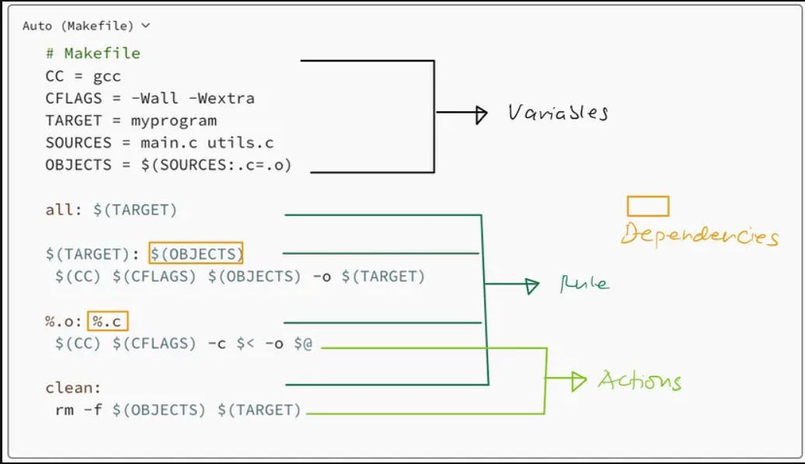

## 🚨 Instructions

A Makefile is made up of 2 main sections: `Variables` and `Rules`.

Variables allow you to specify and reuse certain shell contents and rules are the equivalent of scripts commands in Javascript's package.json.

#### Compilation

When you run `make`, the default rule to be executed is `.c.o`. This runs a compilation of the files that have been specified in your Source.

`$<`: This represents the first prerequisite (dependency) of the rule. In the context of a compilation rule like .c.o, `$<` would represent the source file (typically a .c file). For example, if you have a rule to compile foo.c into foo.o, `$<` would be foo.c.

`${<:.c=.o}`: This is a variable substitution operation. It replaces the .c extension of the source file with .o, effectively changing the file extension from .c to .o. For example, if `$<` is foo.c, `${<:.c=.o}` would be foo.o.

This step ends with your .c files being compiled into .o files, which is an intermediate step to creating your library.

> **Note**: It is important to not use `${SOURCES}` and `${OBJECTS}` as declared in the Variables directly as that would result in trying to compile all source files into all object files at once, which is not how compilation works. Each source file should be compiled into its corresponding object file separately. Additionally, specifying `-o ${OBJECTS}` implies that you're trying to generate multiple output files with a single compilation command, which is not allowed. As such, you need to compile each source file separately into its corresponding object file, which is done with the above syntax.

#### Archiving

`${NAME}: ${OBJECTS}`

- `${NAME}`: This is a variable representing the name of the target, which in this case is the library to be created (specified as `libft.a` in the Makefile).
- `${OBJECTS}`: This is a variable representing the list of object files required to create the target. These object files are the result of compiling the corresponding .c files.

This line indicates that the target `${NAME}` depends on the list of object files specified in `${OBJECTS}`. Before Make can build the `libft.a` library, it needs to ensure that all the object files specified in `${OBJECTS}` are up to date.

`${LIBC} ${NAME} ${OBJECTS}`

- `${LIBC}`: This is a variable representing the command to create a library archive.

This line specifies the command to create the library archive (`libft.a`) using the `${LIBC}` command, with the object files `${OBJECTS}` as inputs. The `${LIBC}` command is typically `ar rcs`, which stands for "archive create with replacement and silent". This command will create the library archive `libft.a` with the specified object files.

#### Indexing

`${LIBR} ${NAME}`

- `${LIBR}`: This is a variable representing the command to index a library archive.

This line specifies the command to index the library archive (`libft.a`) using the `${LIBR}` command. Indexing a library archive is an optional step that can improve the performance of certain operations, especially when linking against the library. The `${LIBR}` command is typically ranlib, which generates an index (or updates an existing index) for the library archive.
