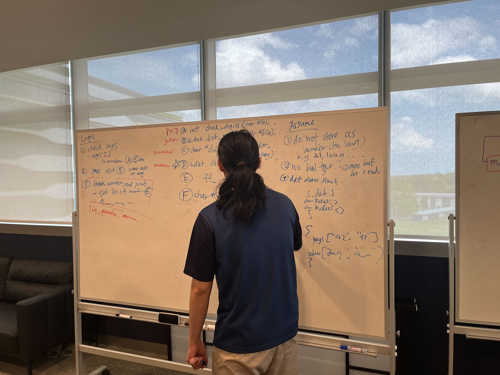
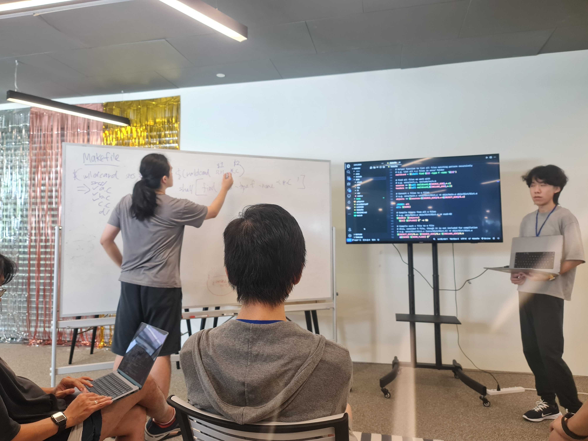

# Rush02: Number Dictionary 📚

The objective of this Rush was to build a program that could take a number input, and output it in it's written form.

Keys in the dictionary were guaranteed, though new entries may be added. Each key's values could also be changed, and their corresponding values would be printed.

This Rush also served as my first foray into working on a project as a team. 3 of our groups decided to team up to work on this together. There were 2 amongst us who were already working as Software Engineers, and they served as leads in guiding the rest of us. We broke down the tasks required and split the work accordingly. Some of us worked on a task together as a pair, and we eventually pieced all the work together in a single Github repo before submission.


Img 1. Marcus leading the task breakdown and allocation

Before our evaluation, we gathered again to walk through everyone's work to make sure that everyone understood how the entire codebase worked.


Img 2. Marcus leading the code walkthrough


Img 3. An audience from the rest of the cohort gathered. Everyone was fascinated by what we've accomplished.

This has certainly been the biggest project that I've worked on in the entire Piscine, and it was an amazing experience working on this with 2 very experienced, and patient, technical leads. Thank you for the opportunity Marcus and Justin :)

## 🚨 Usage

### Setup

```
cd 42-piscine/rush02
make fclean
make
./rush-02 <number>
```

### Usage

```
$> ./rush-02 42 | cat -e
forty two$
$> ./rush-02 0 | cat -e
zero$
$> ./rush-02 10.4 | cat -e
Error$
$> ./rush-02 100000 | cat -e
one hundred thousand$
$> grep "20" numbers.dict | cat -e 20 : hey everybody !$
$> ./rush-02 20 | cat -e
hey everybody !$
```
